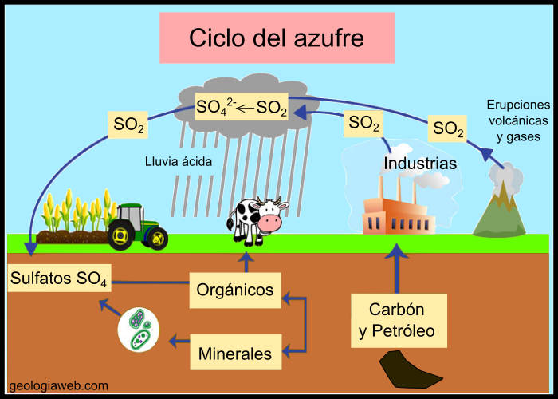

## Contexto

-   El azufre atrapado en **combustibles fósiles, industrias metalurgicas, refinerias, termoelectricas o en el magma volcánico** se libera a la atmósfera como gas $SO_2$ tras la combustión o erupción.

-   El $SO_2$ impacta negativamente en el sistema respiratorio provocando tos, secreción mucosa, agravamiento del asma y bronquitis crónica; y en el sistema cardiovascular.

-   Provoca daño a la vegetación (clorosis) y la corrosión de materiales.

{width="498"}

## Sectores de medición de SO2

```{r, echo=FALSE, include=FALSE}
#Librerías
library(tsibble)
library(dplyr)
library(lubridate)
library(fpp3)
library(tidyverse)
library(leaflet)
library(zoo)
library(fable)
library(imputeTS)
library(ggplot2)
library(tidyr)
library(stringr)
library(patchwork)
library(feasts)
library(knitr)
library(leaflet)
ruta<-"maate_concentracionso2_2021diciembre.csv"
```

\##<https://mapcarta.com/es/19666194>\## Fuente de las locaciones

```{r}
# 1. Definir coordenadas centrales de los sectores
ubicaciones_sectores <- data.frame(
  SECTOR = c("Belisario", "Carapungo", "Centro Histórico", "Cotocollao", 
             "El Camal", "Guamani", "Los Chillos", "Tumbaco"),
  LAT = c(-0.18994, -0.2544, -0.22365, -0.11475, 
          -0.2494, -0.32894, -0.26667, -0.21226),
  LON = c(-78.50727, -78.54411, -78.51559, -78.49775,
          -78.51975, -78.5596, -78.48333, -78.4045)
)

# 2. Crear Mapa de Áreas
leaflet() |>
  addTiles() |> # Mapa base (Calles)
  # CAPA 1: Áreas de los Sectores 
  addCircles(data = ubicaciones_sectores,
             lng = ~LON, lat = ~LAT,
             radius = 2000, # Radio en metros (2 km)
             color = "red",       # Color del borde
             fillColor = "red",   # Color de relleno
             fillOpacity = 0.2,   # Transparencia (para ver el mapa debajo)
             popup = ~paste("Sector:", SECTOR),
             group = "Sectores (Áreas)") |>
  addLayersControl(
    overlayGroups = c("Sectores (Áreas)", "Mis Puntos"),
    options = layersControlOptions(collapsed = FALSE)
  )
```

```{r, echo=FALSE, warning=FALSE}
datos_so2 <- read.csv(ruta, sep = ";")
head(datos_so2)
datos_so2 <- datos_so2 |>  mutate(FECHA=dmy(paste(DIA, MES, ANIO)))

so2_diario <- datos_so2 |> 
  mutate(SO2 = as.numeric(SO2)) 


```

```{r warning=FALSE, include=FALSE}

vector_estaciones <- c("El Camal", "Carapungo", "Cotocollao", "Tumbaco","Los Chillos","Guamani")

so2_ts <- so2_diario |> 
    filter(!is.na(SO2)) |> 
    filter(PROV == "Pichincha", ESTACION %in% vector_estaciones) |> 
    select(FECHA, ESTACION, SO2) |> 
    as_tsibble(index = FECHA, key = ESTACION) |> 
    fill_gaps() |> 
    mutate(SO2 = imputeTS::na_seadec(SO2, algorithm = "interpolation", 
                                     find_frequency = TRUE))

```

Con la frecuencia diaria, pues, el SO2 al ser una sustancia muy volatil, es de interés saber los días que se alcanzan los máximos durante el año. Además que el SO2 suele estar ligado a la actividad humana, entonces, la medición diaria del SO2 tiene la capacidad de mostrar patrones cruciales. (REFERENCIA)

## Diversidad de las series de interés

#### Tendencia

```{r, echo=FALSE}

so2_ts |> 
  autoplot(SO2) +
  labs(title = "Estaciones", x="Tiempo") +
  facet_wrap(vars(ESTACION), scales = "free_y", ncol = 2) +
  theme(legend.position = "none")

```

## Test KPSS

Probamos el Test de KPSS para determinar si las series son o no estacionarias:

```{r, echo=FALSE}
test_kpss_todos <- so2_ts |> 
  features(SO2, unitroot_kpss)

tabla_kpss <- test_kpss_todos |> 
  filter(ESTACION %in% vector_estaciones)

kable(
  tabla_kpss,
  caption = "Resultados de la Prueba KPSS", 
  col.names = c("Fuente", "Estadístico", "Valor P"),
  digits = 4
)                                 
```

En todos los casos, se rechaza la idea que las series sean estacionarias pues, el *p-value* es menor o igual a 0.01, a excepción de Guamani, que resulta ser estacionaria.

## Ordenes de diferenciación

Aplicamos el test KPSS para determinar el orden de diferenciación para llevar a las series a ser estacionarias.

```{r, echo=FALSE}

ordenes_diff <- so2_ts |> 
  features(SO2, unitroot_ndiffs)

tabla_ordenes <- ordenes_diff |> 
  filter(ESTACION %in% vector_estaciones)


kable(
  tabla_ordenes,
  caption = "**Órdenes de Diferenciación Requeridas (ndiffs)**",
  col.names = c("Serie", "Orden (d)"), 
  digits = 0
)
```

Basta con la diferencia de orden 1 para que las series sean estacionarias

## Orden de diferencia estacional

Aplicamos el test unitroot_nsdiffs para determinar el número de diferencias estacionales requeridas para llevar a las series a ser estacionarias.

```{r, echo=FALSE}

ordenes_diff_st <- so2_ts |> 
  features(SO2, unitroot_nsdiffs)

tabla_ordenes <- ordenes_diff_st |> 
  filter(ESTACION %in% vector_estaciones)


kable(
  tabla_ordenes,
  caption = "**Órdenes de Diferenciación Estacional Requeridas (nsdiffs)**",
  col.names = c("Serie", "Orden (d)"), 
  digits = 0
)
```

Por ende, no es necesario diferenciar estacionalmente la serie. Así, aplicamos la diferenciación de la componente no estacional.

## Series Diferenciadas

```{r, echo=FALSE, warning=FALSE}
so2_ts |> 
  filter(ESTACION != "Guamani") |> 
  mutate(SO2_diff=difference(SO2)) |> 
  autoplot(SO2_diff) + 
  labs(title = "Serie diferenciada: \n Cantidad de SO2 por estación (Guamani Excluido)") + 
  facet_wrap(vars(ESTACION), scales = "free_y", ncol = 2) + 
  theme(legend.position = "none")
```

Ahora, con nuestras series transformadas a series estacionarias, la información del ACF y PACF será de interés.

## ACF

```{r, echo=FALSE}
library(patchwork) 
p1 <- so2_ts |> 
  filter(ESTACION == "Guamani") |> 
  ACF(SO2) |> 
  autoplot() + 
  labs(title = "ACF de cantidad de SO2 en estación diferenciada Guamani") +
  facet_wrap(vars(ESTACION), scales = "fixed", ncol = 2) +
  theme(legend.position = "none")

p1 


```

```{r, echo=FALSE}

so2_ts |> 
  filter(ESTACION != "Guamani") |> 
  mutate(SO2_diff = difference(SO2)) |> 
  ACF(SO2_diff) |> 
  autoplot() + 
  labs(title = "ACF de cantidad de SO2 en estación diferenciada (excepto Guamani)") +
  facet_wrap(vars(ESTACION), scales = "fixed", ncol = 2) +
  theme(legend.position = "none")

```

Los gráficos de la ACF, muestran que existe auto-correlación con lags pasados.

## PACF

```{r, echo=FALSE}
so2_ts |> 
  filter(ESTACION == "Guamani") |>
  PACF(SO2) |> 
  autoplot() + 
  labs(title = "PACF de cantidad de SO2 en estación diferenciada Guamani") +
  facet_wrap(vars(ESTACION), scales = "fixed", ncol = 2) +
  theme(legend.position = "none")

```

```{r, echo=FALSE}
so2_ts |> 
  filter(ESTACION != "Guamani") |> 
  mutate(SO2_diff=difference(SO2)) |> 
  PACF(SO2_diff) |> 
  autoplot() + 
  labs(title = "PACF de cantidad de SO2 por estación diferenciada (excepto Guamani)") +
  facet_wrap(vars(ESTACION), scales = "fixed", ncol = 2) +
  theme(legend.position = "none")

```

## Modelado

Gracias a los resultados obtenidos, se ha propuesto los siguientes parámetros para el modelamiento:

-   **Guamani (Estación estacionaria por defecto)**

    -   Diferenciación ($d=0, D=0$)

    -   Componente AR ($p=1, P=0$)

    -   Componente MA ($q=1, Q=0$)

-   **Estaciones no estacionarias.**

    -   Diferenciación ($d=1, D=0$)

    -   Componente AR ($p=0, P=0$)

    -   Componente MA ($q=2, Q=0$)

```{r, echo=FALSE, include=FALSE}
separar_datos_entrenamiento_prueba <- function(tsibble_datos, prop_entrenamiento = 0.8) {

  if (!inherits(tsibble_datos, "tbl_ts")) {
    stop("La entrada debe ser un objeto tsibble.")
  }

  datos_entrenamiento <- tsibble_datos |>
    group_by(ESTACION) |> 
    slice_head(prop = prop_entrenamiento) |> 
    ungroup()

  datos_prueba <- tsibble_datos |>
    group_by(ESTACION) |> 
    slice_tail(prop = 1 - prop_entrenamiento) |> 
    ungroup()

  return(list(
    entrenamiento = datos_entrenamiento,
    prueba = datos_prueba
  ))
}

datos_separados <-separar_datos_entrenamiento_prueba(so2_ts)
```

```{r, echo=FALSE, warning=FALSE}
# --- PASO 1: Modelos Manuales (Criterio del Investigador) ---

# A. Para Guamaní (Estacionaria): ARIMA(1,0,1)
fit_guamani <- datos_separados$entrenamiento |>
  filter(ESTACION == "Guamani") |>
  model(
    Modelo_Propuesto = ARIMA(SO2 ~ pdq(1, 0, 1) + PDQ(0, 0, 0, period=7)), 
    Modelo_Automatico = ARIMA(SO2),
    Modelo_SNAIVE     = SNAIVE(SO2 ~ lag(7)),
    Modelo_Lineal     = TSLM(SO2 ~ trend() + season(period=7))
  )

# B. Para el Resto (No Estacionarias): ARIMA(0,1,2)
fit_resto <- datos_separados$entrenamiento |>
  filter(ESTACION != "Guamani") |>
  model(
    Modelo_Propuesto = ARIMA(SO2 ~ pdq(0, 1, 2) + PDQ(0, 0, 0, period=7)),
    Modelo_Automatico = ARIMA(SO2),
    Modelo_SNAIVE    = SNAIVE(SO2 ~ lag(7)),
    Modelo_Lineal    = TSLM(SO2 ~ trend() + season(period=7))
  )


```

## Implementación (AIC,BIC, Parsimonia)

```{r, echo=FALSE}
glance_guamani <- glance(fit_guamani)

glance_resto   <- glance(fit_resto)
tabla_comparativa_1 <- bind_rows(glance_guamani, glance_resto) |>
  filter(.model != "Modelo_SNAIVE") |>
  select(ESTACION, MODELO = .model, AIC, AICc, BIC) |>
  arrange(ESTACION, AICc)
kable(tabla_comparativa_1, 
      caption = "Comparación de Ajuste: Modelo Propuesto vs. Automáticos (Lineal, ARIMA automatico)",
      digits = 2)
```

En rasgos generales, el mejor modelo es el Lineal por tener los valores más bajos de AICm AICc y BIC.

Comparando los modelos: Propuesto y Automático

-   Son muy similares según los ajustes de AIC, AICc y BIC

-   Ambos modelos tratan de capturar la misma dinámica y convergen a resultados parecidos

```{r, echo=FALSE}
tabla_comparativa_2 <- accuracy(bind_rows(fit_guamani, fit_resto)) |>
  select(ESTACION, Modelo = .model, RMSE, MAE) |>
  arrange(ESTACION, RMSE)

kable(tabla_comparativa_2, 
      caption = "Comparación de Modelos por Precisión",
      digits = 2)
```

Aunque el lineal tiene el mejor AIC, su predicción es peor que los modelos ARIMA (propuesto y Automático)

/////Para la expo

Aunque los criterios de información (AIC) favorecían modelos más simples, la validación cruzada (RMSE) demuestra que los modelos ARIMA (Propuesto y Automático) tienen un error de pronóstico significativamente menor

"Dado que el **Modelo Propuesto** tiene un rendimiento muy similar (y a veces superior) al Automático, y además es un modelo que nosotros hemos parametrizado y entendemos teóricamente, lo seleccionamos como el modelo final para las proyecciones."

/////

Nuestros modelos serán:

```{r, echo=FALSE}
todos_los_modelos <- bind_rows(fit_guamani, fit_resto) 
tabla_ordenes <- todos_los_modelos |>
  as_tibble() |> 
  pivot_longer(cols = c(Modelo_Propuesto, Modelo_Automatico), 
               names_to = "Tipo_Modelo", 
               values_to = "Objeto_Modelo") |>
  mutate(Descripcion = format(Objeto_Modelo)) |> 
  select(ESTACION, Tipo_Modelo, Descripcion)

kable(tabla_ordenes, caption = "Órdenes ARIMA (pdq)(PDQ)")
```

## Significancia y estimaciones

```{r, echo=FALSE, warning=FALSE}
##Maxima verosimilitud modelos anteriores
#Estimaciones del mejor modelo de cada estacion
coeficientes_mle <- bind_rows(fit_guamani, fit_resto) |>
  select(-Modelo_Lineal)|>
  tidy() 


# Mostrar tabla
kable(coeficientes_mle, caption = "Coeficientes Estimados (MLE) - Solo ARIMA")
```

## ACF residuos

```{r, echo=FALSE, warning=FALSE}
#Unificación de modelos para diagnóstico masivo
modelos_finales <- bind_rows(fit_guamani, fit_resto)
```

```{r, echo=FALSE}
library(patchwork) # Necesaria para unir gráficos

# 1. Guardamos el Gráfico del Modelo Propuesto en un objeto (g1)
g1 <- modelos_finales |>
  select(Modelo_Propuesto) |> 
  augment() |>
  filter(!is.na(.innov)) |> 
  ACF(.innov, lag_max = 10) |> 
  autoplot() +
  labs(title = "Modelo Propuesto", 
       y = "ACF", x = "Lag") +
  theme_minimal() +
  theme(legend.position = "none")

# 2. Guardamos el Gráfico del Modelo Automático en un objeto (g2)
g2 <- modelos_finales |>
  select(Modelo_Automatico) |> 
  augment() |>
  filter(!is.na(.innov)) |> # Agregué esto por seguridad
  ACF(.innov, lag_max = 10) |> 
  autoplot() +
  labs(title = "Modelo Automático", 
       y = "ACF", x = "Lag") +
  theme_minimal() +
  theme(legend.position = "none")

# 3. Juntamos los dos (Lado a Lado)
# Usamos "|" para ponerlos uno al lado del otro
# Usamos plot_annotation para un título general
g1 | g2 + plot_annotation(title = "Comparación de Residuos (ACF): Propuesto vs. Automático")
```

En Cotocollao y Carapungo, notamos que existe una autocorrelación significativa con el rezago 2, lo que podría sugerir la inclusión de un modelo (MA)

## Ljung Box

$H_0$ Residuos Independientes

```{r, echo=FALSE}

library(dplyr)
library(gt) # O kable si prefieres

# 1. Calcular datos Propuesto
datos_prop <- modelos_finales |>
  select(Modelo_Propuesto) |> augment() |>
  features(.innov, ljung_box, lag = 14, dof = 2) |>
  select(ESTACION, Q_Manual = lb_stat, P_Manual = lb_pvalue)

# 2. Calcular datos Automático
datos_auto <- modelos_finales |>
  select(Modelo_Automatico) |> augment() |>
  features(.innov, ljung_box, lag = 14, dof = 2) |>
  select(ESTACION, Q_Auto = lb_stat, P_Auto = lb_pvalue)

# 3. Unir y mostrar en una sola tabla elegante
left_join(datos_prop, datos_auto, by = "ESTACION") |>
  gt() |>
  tab_header(
    title = "Comparación de Independencia de Residuos (Ljung-Box)",
    subtitle = "Comparativa: Modelo Manual vs. Automático"
  ) |>
  tab_spanner(
    label = "Modelo Propuesto",
    columns = c(Q_Manual, P_Manual)
  ) |>
  tab_spanner(
    label = "Modelo Automático",
    columns = c(Q_Auto, P_Auto)
  ) |>
  fmt_number(columns = -ESTACION, decimals = 4) |>
  tab_style(
    style = cell_text(color = "red", weight = "bold"),
    locations = cells_body(
      columns = c(P_Manual, P_Auto),
      rows = P_Manual < 0.05 | P_Auto < 0.05
    )
  )
```

El modelo automático para los Chillos es la que más limpia está, no es afectada por residuos.

## Heterocedasticidad (varianza depende del tiempo)

```{r, echo=FALSE}
#método de Volatilidad de los residuos^2
modelos_finales |>
  select(Modelo_Propuesto) |>
  augment() |>
  mutate(residuos_sq = .innov^2) |> # Elevamos al cuadrado
  ggplot(aes(x = FECHA, y = residuos_sq)) +
  geom_line() +
  facet_wrap(~ESTACION, scales = "free_y", ncol = 2) +
  labs(title = "Heterocedasticidad: Residuos al Cuadrado",
       subtitle = "Picos altos indican agrupamiento de volatilidad (ARCH effects)",
       y = "Residuos al Cuadrado", x = "Tiempo") +
  theme_minimal()
```

El análisis de residuos al cuadrado muestra que la varianza del error no es constante. Existen periodos de alta volatilidad (agrupamiento), especialmente visibles en la estación **Tumbaco**. Además, se observan valores atípicos extremos al inicio de los registros en Carapungo.

///// Para nosotros

-   **Carapungo** llega a **3000** (Error altísimo).

-   **Guamaní** apenas llega a **200** (Error bajo).

-   **Tumbaco** llega a **150**.

-   Esto confirma que el modelo se ajusta mucho mejor a Guamaní que a Carapungo (donde los errores al cuadrado son enormes).

/////

## Estabilidad

```{r, echo=FALSE, warning=FALSE}

modelos_finales |>
  select(Modelo_Propuesto) |> 
  gg_arma() +
  labs(title = "Verificación de Estabilidad: Raíces Inversas del Modelo",
       subtitle = "Los puntos deben estar DENTRO del círculo para ser estables",
       y = "Parte Imaginaria", 
       x = "Parte Real") +
  theme_minimal()

todos_los_modelos <- bind_rows(fit_guamani, fit_resto) 
tabla_ordenes <- todos_los_modelos |>
  as_tibble() |> 
  pivot_longer(cols = c(Modelo_Propuesto), 
               names_to = "Tipo_Modelo", 
               values_to = "Objeto_Modelo") |>
  mutate(Descripcion = format(Objeto_Modelo)) |> 
  select(ESTACION, Tipo_Modelo, Descripcion)

kable(tabla_ordenes, caption = "Órdenes ARIMA (pdq)(PDQ)")
```

## Pronosticos

```{r}
h <- 6*7
fc1_guamani <- fit_guamani |>
  forecast(h=h)
# Resto
fc1_resto <- fit_resto |> 
  forecast(h=h)
fc1_guamani |>
  autoplot(so2_ts |> 
             filter(ESTACION == "Guamani", 
                    yearmonth(FECHA) >= yearmonth("2018-01") &
                      yearmonth(FECHA) <= yearmonth("2018-02")), 
           level = NULL
  ) +
  labs(
    x = "2018", y = "SO2 HG/m^3",
    title = "Pronósticos de la cantidad de S02 en Guamani"
  ) +
  guides(colour = guide_legend(title = "Modelos"))
```

```{r}
# Camal
fc1_resto |> 
  filter(ESTACION == "El Camal") |>
  autoplot(so2_ts |> 
             filter(ESTACION == "El Camal", 
                    yearmonth(FECHA) >= yearmonth("2016-01") & 
                    yearmonth(FECHA) <= yearmonth("2016-04")),
           level = NULL
  ) +
  labs(
    x = "2018", 
    y = "Concentración SO2",
    title = "Pronósticos SO2: El Camal"
  ) +
  guides(colour = guide_legend(title = "Modelos"))
```

```{r}
# Carapungo
fc1_resto |> 
  filter(ESTACION == "Carapungo") |>
  autoplot(so2_ts |> 
             filter(yearmonth(FECHA) >= yearmonth("2016-03") &
                      yearmonth(FECHA) <= yearmonth("2016-05")), 
           level = NULL
  ) +
  labs(
    x = "2016", y = "SO2 HG/m^3",
    title = "Pronósticos de la cantidad de S02 en Carapungo"
  ) +
  guides(colour = guide_legend(title = "Modelos"))

```

```{r}
# Cotocollao
fc1_resto |> 
  filter(ESTACION == "Cotocollao") |>
  autoplot(so2_ts |> 
             filter(yearmonth(FECHA) >= yearmonth("2016-03") &
                      yearmonth(FECHA) <= yearmonth("2016-05")), 
           level = NULL
  ) +
  labs(
    x = "2016", y = "SO2 HG/m^3",
    title = "Pronósticos de la cantidad de S02 en Cotocollao"
  ) +
  guides(colour = guide_legend(title = "Modelos"))
```

```{r}
# Tumbaco
fc1_resto |> 
  filter(ESTACION == "Tumbaco") |>
  autoplot(so2_ts |> 
             filter(yearmonth(FECHA) >= yearmonth("2017-01") &
                      yearmonth(FECHA) <= yearmonth("2017-02")), 
           level = NULL
  ) +
  labs(
    x = "2017", y = "SO2 HG/m^3",
    title = "Pronósticos de la cantidad de S02 en Tumbaco"
  ) +
  guides(colour = guide_legend(title = "Modelos"))
```

```{r}
# Los Chillos
fc1_resto |> 
  filter(ESTACION == "Los Chillos") |>
  autoplot(so2_ts |> 
             filter(yearmonth(FECHA) >= yearmonth("2017-10") &
                      yearmonth(FECHA) <= yearmonth("2017-11")), 
           level = NULL
  ) +
  labs(
    x = "2017", y = "SO2 HG/m^3",
    title = "Pronósticos de la cantidad de S02 en Los Chillos"
  ) +
  guides(colour = guide_legend(title = "Modelos"))
```

## Mejor modelo

```{r}
todos_modelos <- bind_rows(fit_guamani, fit_resto)
metricas_rmse <- accuracy(todos_modelos) |> 
  select(ESTACION, .model, RMSE)
metricas_aic <- glance(todos_modelos) |> 
  select(ESTACION, .model, AIC)
tabla_mejores <- metricas_rmse |>
  left_join(metricas_aic, by = c("ESTACION", ".model")) |>
  group_by(ESTACION) |>
  slice_min(order_by = RMSE, n = 1) |> 
  select(ESTACION, Mejor_Modelo = .model, RMSE, AIC) |>
  arrange(RMSE)

kable(tabla_mejores, 
      caption = "Mejor Modelo por Estación (Criterio: Mínimo RMSE)",
      digits = 2)
```

## Discusion

```{r}
coeficientes_propuestos <- bind_rows(fit_guamani, fit_resto) |>
  select(ESTACION, Modelo_Propuesto) |> # Seleccionamos solo el modelo manual
  tidy() |> 
  select(ESTACION, Termino = term, Estimacion = estimate, Error_Std = std.error, P_Valor = p.value)

kable(coeficientes_propuestos, 
      caption = "Coeficientes de los Modelos Propuestos (ARIMA Manual)",
      digits = 4)

```

##### Componente Autorregresivo (AR): "Memoria"

Para las estaciones Camal, Carapungo, Los Chillos y Tumbaco, Estas estaciones presentan un coeficiente AR(1) positivo y significativo, lo que denota una alta persistencia de la contaminación. Esto sugiere que las condiciones meteorológicas en estos sectores no favorecen una dispersión inmediata, generando episodios de alta concentración tienden a durar varios días.

A diferencia del resto, Cotocollao muestra un comportamiento de oscilatorio. Esto implica que la atmósfera en este sector tiene una dinámica más volátil, posiblemente debido a vientos locales que evitan la acumulación sostenida del contaminante de un día para otro.

Se confirma una fuerte dependencia temporal (alta memoria). Físicamente, esto se interpreta como una zona de baja capacidad dispersiva, donde el $SO_2$​ se acumula y queda atrapado, probablemente debido a la topografía del sur de Quito o a fuentes de emisión constantes sin ventilación adecuada.

##### Componente de Media Móvil (MA): "Persistencia"

Los coeficientes negativos implican la dispersion de SO2 en las zonas correspondientes, muchas concentraciones de SO2 son desplazadas diariamente a traves de vientos fuertes o por las nubes que las arrastran para generar las lluvias acidas.

El signo negativo en el coeficiente MA indica un mecanismo de corrección rápida. Físicamente, esto sugiere que estas zonas están expuestas a dinámicas de ventilación activa (vientos fuertes o turbulencia) o lavado atmosférico (lluvia). Cuando ocurre un incremento abrupto de SO2​ (un choque), este no persiste, sino que es dispersado eficazmente, haciendo que los niveles retornen rápidamente (o incluso caigan por debajo) de la media al día siguiente. El sistema 'castiga' los excesos inmediatos.

Por el contrario, Cotocollao presenta un coeficiente positivo, lo que implica una persistencia del choque. En este sector, los eventos inesperados de contaminación no se disipan inmediatamente, sino que se 'arrastran' parcialmente al día siguiente. Esto denota una menor capacidad de ventilación inmediata ante eventos puntuales, permitiendo que los remanentes de contaminación permanezcan en el aire por más tiempo.

##### Residuos: "Ruido"

Los residuos del modelo representan la componente no sistemática de la concentración de $SO2$​. En el contexto de Quito, se interpreta que este componente almacena la información de variables meteorológicas dinámicas (viento, precipitación) y eventos de emisión discretos que no siguen un patrón calendario fijo. El hecho de que los residuos se aproximen a ruido blanco (sin autocorrelación) indica la naturaleza caótica e impredecible de la atmósfera urbana.

#### Conclusión del desempeño

Los modelos ARIMA superaron en precisión (menor RMSE) tanto a la regresión lineal (TSLM) como al método ingenuo (SNAIVE), demostrando que la concentración de $SO2$​ obedece a una dinámica estocástica compleja y no a patrones deterministas simples. El ajuste de la media fue satisfactorio, logrando residuos sin autocorrelación.

#### Limitaciones y posibles extenciones

Los modelos ARIMA ignoran variables meteorológicas críticas (viento, lluvia) que limpian o dispersan el contaminante, limitando la predicción de cambios bruscos. Se siguen posibles implementaciones de modelos ARIMAX para incluir forzantes meteorológicos, o modelos híbridos ARIMA para modelar explícitamente la volatilidad variable y mejorar la estimación de riesgo en alertas ambientales.
